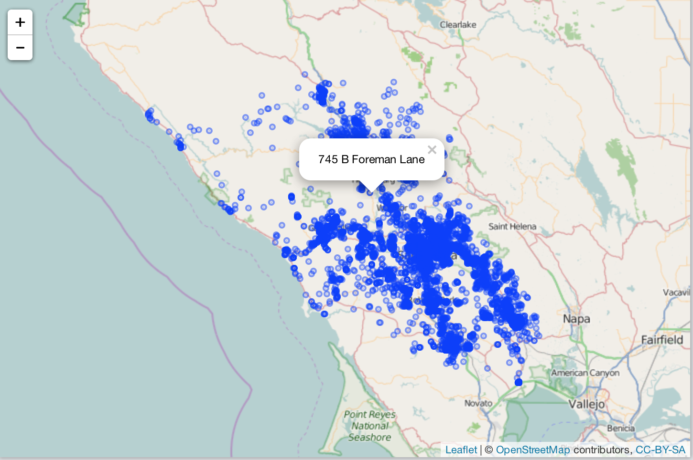

openadds
========

```{r echo=FALSE}
knitr::opts_chunk$set(
  warning = FALSE,
  message = FALSE,
  collapse = TRUE,
  comment = "#>"
)
```

[](https://travis-ci.org/sckott/openadds)
[](https://ci.appveyor.com/project/sckott/openadds)
[](https://codecov.io/github/sckott/openadds?branch=master)
[](https://github.com/metacran/cranlogs.app)
[](https://cran.r-project.org/package=openadds)


`openadds` is an R client for data from [Openaddresses.io](http://openaddresses.io/). Data comes from <http://data.openaddresses.io>.

The reason for creating this R client is that the data coming from OpenAddresses is heterogenous in many ways:

* File types: sometimes provided as a csv, sometimes as a Shape file
* Data fields: columns in each dataset vary. Some have no lat/long data, or if present are variously labeled `LON`/`LONGITUDE/LNG` etc., and address fields are especially variable

This pacakge tries to make it easy to retreive the data, as well as combine data sets, and visualize.

## Install

CRAN (and get `leaflet`)

```{r eval=FALSE}
install.packages(c("leaflet", "openadds"))
```

Dev version

```{r eval=FALSE}
devtools::install_github("sckott/openadds")
```

```{r}
library("openadds")
```

## List datasets

```{r}
(dat <- oa_list())
```

## Search for datasets

```{r}
oa_search(country = "us", state = "ca")
```

## Get data

Passing in a URL

```{r}
(out1 <- oa_get(dat$processed[5]))
```

First getting URL for dataset through `as_openadd()`, then passing to `oa_get()`

```{r}
(x <- as_openadd("us", "nv", "las_vegas"))
```

```{r}
oa_get(x)
```

## Combine multiple datasets

```{r}
out2 <- oa_get(dat$processed[35])
(alldat <- oa_combine(out1, out2))
```

## Map data

Get some data

```{r eval=FALSE}
x <- oa_get(oa_search(city = "oregon_city")[1,]$url)
```

Make an interactive map

```{r eval=FALSE}
library("leaflet")
leaflet(x) %>%
  addTiles() %>%
  addCircles(lat = ~LAT, lng = ~LON, popup = ~STREET)
```



## Meta

* Please note that this project is released with a [Contributor Code of Conduct](CONDUCT.md). By participating in this project you agree to abide by its terms.
* Please [report any issues or bugs](https://github.com/sckott/openadds/issues)
* License: MIT
