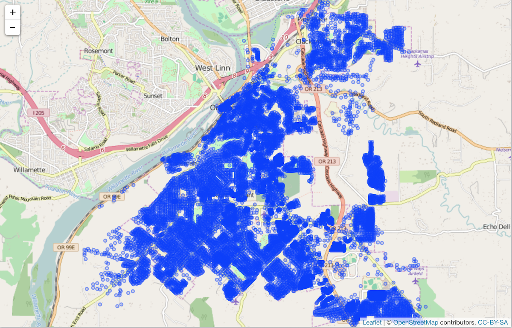

openadds
========


[](https://cranchecks.info/pkgs/openadds)
[](https://travis-ci.org/sckott/openadds)
[](https://ci.appveyor.com/project/sckott/openadds)
[](https://codecov.io/github/sckott/openadds?branch=master)
[](https://github.com/metacran/cranlogs.app)
[](https://cran.r-project.org/package=openadds)


`openadds` is an R client for data from <https://openaddresses.io/>. Data comes from <http://results.openaddresses.io/>.

The reason for creating this R client is that the data coming from OpenAddresses is heterogenous in many ways:

* File types: sometimes provided as a csv, sometimes as a Shape file
* Data fields: columns in each dataset vary. Some have no lat/long data, or if present are variously labeled `LON`/`LONGITUDE/LNG` etc., and address fields are especially variable

This pacakge tries to make it easy to retreive the data, as well as combine data sets, and visualize.

## Install

CRAN (and get `leaflet`)


```r
install.packages(c("leaflet", "openadds"))
```

Dev version


```r
devtools::install_github("sckott/openadds")
```


```r
library("openadds")
```

## List datasets


```r
(dat <- oa_list())
#> # A tibble: 2,384 x 16
#>    source cache sample `geometry type` `address count` version fingerprint
#>    <chr>  <chr> <chr>  <chr>                     <int> <chr>   <chr>      
#>  1 ae/du… http… http:… Point                    127655 <NA>    880f5b19a9…
#>  2 ae/du… http… http:… Point                    128058 <NA>    7aabcea765…
#>  3 ar/c/… http… http:… <NA>                     555755 <NA>    e76afd805a…
#>  4 ar/m/… http… http:… Polygon                   30870 <NA>    0e82a5cb0d…
#>  5 at/31… http… http:… <NA>                     218885 <NA>    f06a9cd175…
#>  6 at/31… http… http:… <NA>                     910854 <NA>    f06a9cd175…
#>  7 at/31… http… http:… <NA>                    1201531 <NA>    f06a9cd175…
#>  8 at/ci… http… http:… <NA>                     282313 <NA>    00d6d62202…
#>  9 at/ti… http… http:… Unknown                  194136 <NA>    9a8bb12e58…
#> 10 au/ac… http… http:… Point                    211142 <NA>    f76401eec0…
#> # ... with 2,374 more rows, and 9 more variables: `cache time` <time>,
#> #   processed <chr>, `process time` <time>, `process hash` <chr>,
#> #   output <chr>, `attribution required` <chr>, `attribution name` <chr>,
#> #   `share-alike` <chr>, `code version` <chr>
```

## Search for datasets


```r
oa_search(country = "us", state = "ca")
#> # A tibble: 86 x 5
#>    country state city          id    url                                  
#>  * <chr>   <chr> <chr>         <chr> <chr>                                
#>  1 us      ca    alameda       ""    http://data.openaddresses.io/runs/52…
#>  2 us      ca    amador        ""    http://data.openaddresses.io/runs/52…
#>  3 us      ca    berkeley      ""    http://data.openaddresses.io/runs/52…
#>  4 us      ca    butte         ""    http://data.openaddresses.io/runs/52…
#>  5 us      ca    calaveras     ""    http://data.openaddresses.io/runs/52…
#>  6 us      ca    city_of_anah… ""    http://data.openaddresses.io/runs/52…
#>  7 us      ca    city_of_bake… ""    http://data.openaddresses.io/runs/52…
#>  8 us      ca    city_of_brea  ""    http://data.openaddresses.io/runs/52…
#>  9 us      ca    city_of_burb… ""    http://data.openaddresses.io/runs/52…
#> 10 us      ca    city_of_cars… ""    http://data.openaddresses.io/runs/52…
#> # ... with 76 more rows
```

## Get data

Passing in a URL


```r
(out1 <- oa_get(dat$processed[5]))
#> <Openaddresses data> 31254
#> paths: /Users/sckott/Library/Caches/openadds-ca ...
#> data set sizes (NROW): 218885
#> first data_frame ...  
#> # A tibble: 218,885 x 11
#>      LON   LAT NUMBER STREET UNIT  CITY  DISTRICT REGION POSTCODE ID   
#>    <dbl> <dbl> <chr>  <chr>  <chr> <chr> <chr>    <chr>     <int> <chr>
#>  1  11.4  47.2 21     Bachg… <NA>  <NA>  <NA>     <NA>       6080 <NA> 
#>  2  11.4  47.2 51     Bachg… <NA>  <NA>  <NA>     <NA>       6080 <NA> 
#>  3  11.4  47.2 1      Burgw… <NA>  <NA>  <NA>     <NA>       6080 <NA> 
#>  4  11.4  47.2 15     Burgw… <NA>  <NA>  <NA>     <NA>       6080 <NA> 
#>  5  11.4  47.2 21     Burgw… <NA>  <NA>  <NA>     <NA>       6080 <NA> 
#>  6  11.4  47.2 23     Burgw… <NA>  <NA>  <NA>     <NA>       6080 <NA> 
#>  7  11.4  47.2 52     Burgw… <NA>  <NA>  <NA>     <NA>       6080 <NA> 
#>  8  11.4  47.2 1      Grill… <NA>  <NA>  <NA>     <NA>       6080 <NA> 
#>  9  11.4  47.2 3      Grill… <NA>  <NA>  <NA>     <NA>       6080 <NA> 
#> 10  11.4  47.2 5      Grill… <NA>  <NA>  <NA>     <NA>       6080 <NA> 
#> # ... with 2.189e+05 more rows, and 1 more variable: HASH <chr>
```

First getting URL for dataset through `as_openadd()`, then passing to `oa_get()`


```r
(x <- as_openadd("us", "nv", "las_vegas"))
#> <<OpenAddreses>> 
#>   <<country>> us
#>   <<state>> nv
#>   <<city>> las_vegas
```


```r
oa_get(x)
#> <Openaddresses data> las_vegas
#> paths: /Users/sckott/Library/Caches/openadds-ca ...
#> data set sizes (NROW): 743285
#> first data_frame ...  
#> # A tibble: 743,285 x 11
#>      LON   LAT NUMBER STREET  UNIT CITY  DISTRICT REGION POSTCODE ID   
#>    <dbl> <dbl>  <int> <chr>  <int> <chr> <chr>    <chr>  <chr>    <chr>
#>  1 -115.  36.2      0 <NA>      NA <NA>  <NA>     <NA>   <NA>     <NA> 
#>  2 -115.  36.1   2135 BERNA…    NA <NA>  <NA>     <NA>   <NA>     <NA> 
#>  3 -115.  36.2   1985 DUNEV…    NA <NA>  <NA>     <NA>   <NA>     <NA> 
#>  4 -115.  36.2      0 <NA>      NA <NA>  <NA>     <NA>   <NA>     <NA> 
#>  5 -115.  36.2      0 <NA>      NA <NA>  <NA>     <NA>   <NA>     <NA> 
#>  6 -115.  36.0    613 MT EL…    NA <NA>  <NA>     <NA>   <NA>     <NA> 
#>  7 -115.  36.0    597 MT HU…    NA <NA>  <NA>     <NA>   <NA>     <NA> 
#>  8 -115.  36.3      0 <NA>      NA <NA>  <NA>     <NA>   <NA>     <NA> 
#>  9 -115.  36.2      0 <NA>      NA <NA>  <NA>     <NA>   <NA>     <NA> 
#> 10 -115.  36.1      0 <NA>      NA <NA>  <NA>     <NA>   <NA>     <NA> 
#> # ... with 7.433e+05 more rows, and 1 more variable: HASH <chr>
```

## Combine multiple datasets


```r
out2 <- oa_get(dat$processed[35])
(alldat <- oa_combine(out1, out2))
#> # tibble [1,871,200 × 4]
#>      lon   lat address        dataset
#>  * <dbl> <dbl> <chr>          <chr>  
#>  1  11.4  47.2 21 Bachgangweg 31254  
#>  2  11.4  47.2 51 Bachgangweg 31254  
#>  3  11.4  47.2 1 Burgweg      31254  
#>  4  11.4  47.2 15 Burgweg     31254  
#>  5  11.4  47.2 21 Burgweg     31254  
#>  6  11.4  47.2 23 Burgweg     31254  
#>  7  11.4  47.2 52 Burgweg     31254  
#>  8  11.4  47.2 1 Grillhofweg  31254  
#>  9  11.4  47.2 3 Grillhofweg  31254  
#> 10  11.4  47.2 5 Grillhofweg  31254  
#> # ... with 1,871,190 more rows
```

## Map data

Get some data


```r
x <- oa_get(oa_search(city = "oregon_city")[1,]$url)
```

Make an interactive map


```r
library("leaflet")
leaflet(x[[1]]) %>%
  addTiles() %>%
  addCircles(lat = ~LAT, lng = ~LON, popup = ~STREET)
```



## Meta

* Please note that this project is released with a [Contributor Code of Conduct](CODE_OF_CONDUCT.md). By participating in this project you agree to abide by its terms.
* Please [report any issues or bugs](https://github.com/sckott/openadds/issues)
* License: MIT
